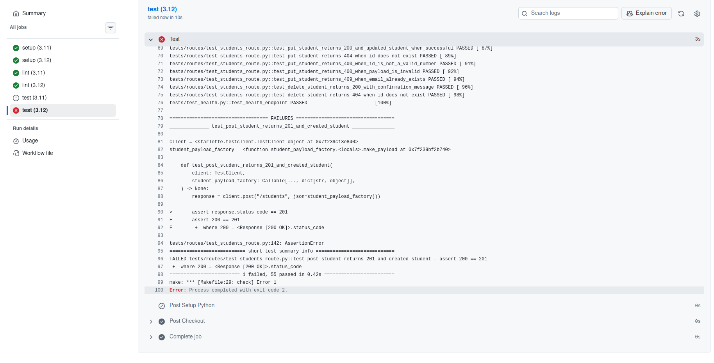
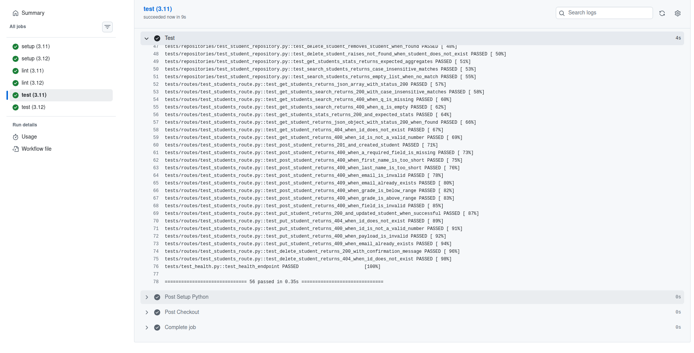

# API REST + Pipeline CI/CD

[](https://github.com/alexandreNoens/ynov-cicd-tp01/actions/workflows/ci.yml)

Créez une API REST, écrivez des tests, configurez un linter et mettez en place un pipeline d'intégration continue.

## Prérequis

- Python 3.11+
- uv

## Démarrage

### 1) Installer le projet

```bash
make install
```

Crée l'environnement virtuel si besoin, génère le lock des dépendances avec hashes et installe les dépendances.

### 2) Initialiser la base de données (reset)

```bash
make install-db
```

Supprime et recrée la base SQLite, puis charge le schéma et les données de dev.

### 3) Lancer l'application

```bash
make serve
```

Lance l'API FastAPI en local avec rechargement automatique.

## Documentation API

- Swagger UI : http://127.0.0.1:8000/docs (référence principale)
- ReDoc : http://127.0.0.1:8000/redoc
- Version statique (repo) : [docs/index.html](docs/index.html)
	- [docs/swagger.html](docs/swagger.html)
	- [docs/redoc.html](docs/redoc.html)
	- [docs/openapi.json](docs/openapi.json)
- Version statique en ligne (GitHub Pages) :
	- https://alexandrenoens.github.io/ynov-cicd-tp01/
	- https://alexandrenoens.github.io/ynov-cicd-tp01/swagger.html
	- https://alexandrenoens.github.io/ynov-cicd-tp01/redoc.html

### Exemples rapides

```bash
# Liste paginée + tri
curl "http://127.0.0.1:8000/students?page=1&limit=5&sort=grade&order=desc"

# Détail d'un étudiant
curl "http://127.0.0.1:8000/students/1"

# Recherche (insensible à la casse)
curl "http://127.0.0.1:8000/students/search?q=grAn"
```

Pour le détail des schémas, codes de retour et payloads, utilisez Swagger (`/docs`).

## Qualité

### Lancer les tests

```bash
make check
```

Exécute les tests avec pytest et affiche la couverture de code.

### Lancer le linter

```bash
make lint
```

Exécute le lint avec ruff.

## Cycle Red → Green (CI)

### Pipeline rouge (bug intentionnel)



### Pipeline vert (bug corrigé)

